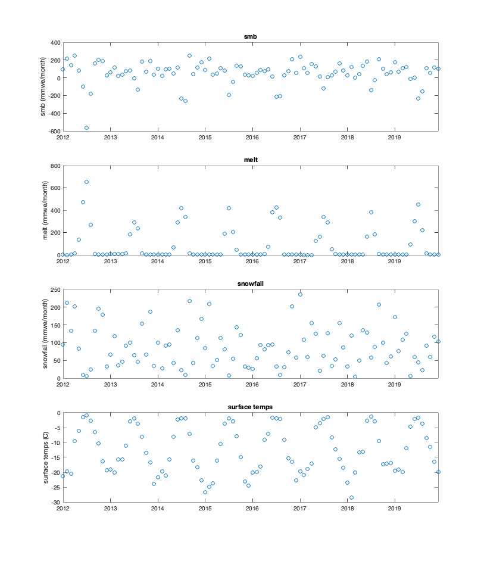

---
title: MAR Output at Camp Recovery
--- 

Approximate Camp R coords
lat = 61.75
lon = -46.86

MAR coords 
lat = 61.74
lon = -46.85

Time series shows low smb due to low snowfall in 2016. We can see the 2016 summer surface. 2015 is obscured, though small possibility it could be surface seen just below 2016 in the [radar data](/FirnGPRProjWNanna/radardata){: .internal-link}.
- [ ] do back of envelope – how close together could 2016 and 2015 summer surfaces be given compaction + melt
- [ ] create plausible ice core given smb, available melt

_Link to Jupyter notebook plotting coming soon_

