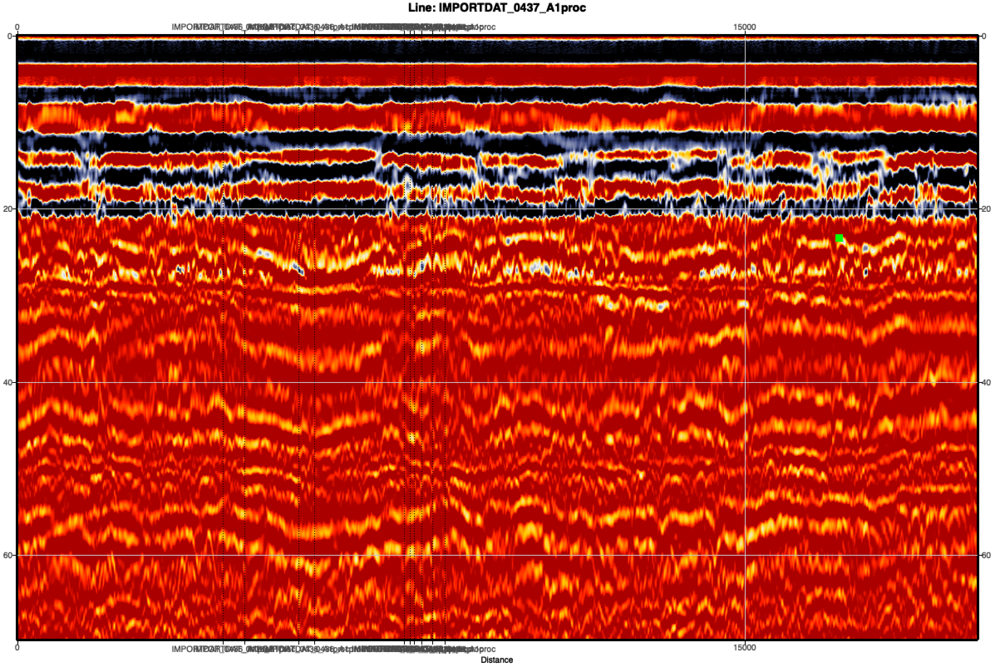

using the cores, we can follow the surfaces, and give a range of density – impacts penetration depth and surface height change
airborne/satellite radar penetration depth 
area where we show density and air content, and this changes in a way that influences satellite signal
impact if regional models predict too much/too little melt? ←> how does this agree or disagree with cores

** summer surface prevents percolate and encourages ice lens formation on top
** variability of ice lens distribution
