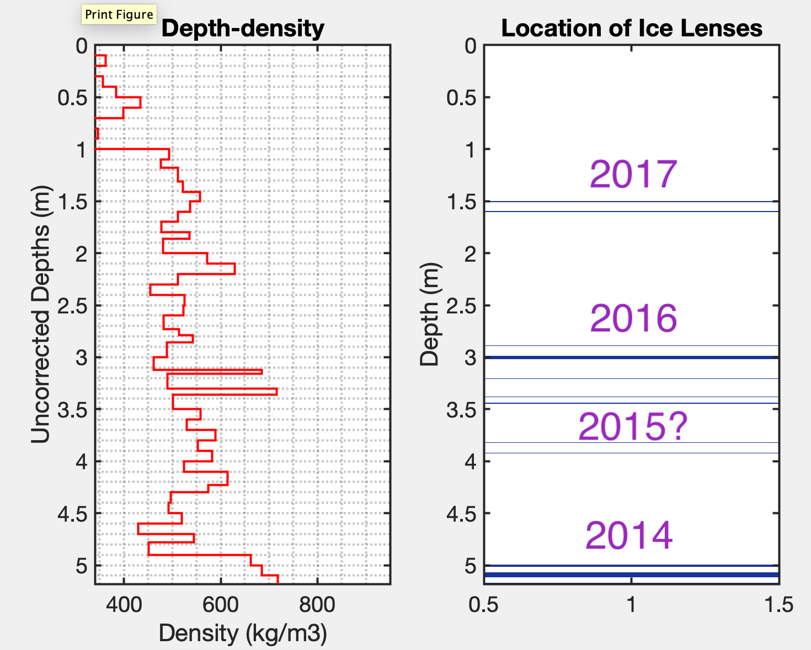

Ice core at target 5 shows some ice lenses, although none are terribly thick
total ice = 36 cm

This represents 2014 - 2017 (?)

We want to know if MAR melt provides enough water to form ice lenses. Crude calculation: assume the distribution of ice lenses in this core is representative of all locations.

This would give us:

mass_ice = $360 mmie * 1km^2 * 900 kg/m³$
mmwe = $360mmie∗900kg/m³/1000$ = 324 mmwe ← expected melt available through 4 years
mmwe = melt -runoff 

From [MAR output](/FirnGPRProjWNanna/MAROutput){: .internal-link}, 

sum(melt-runoff, 2014-2017) = 2009 mmwe
indicates ~ 2.23 m of ice lenses should be present within firn pack if all availble melt is refrozen 5-10x more than we see in the [ice core](/FirnGPRProjWNanna/Target5CoreDensity){: .internal-link}
