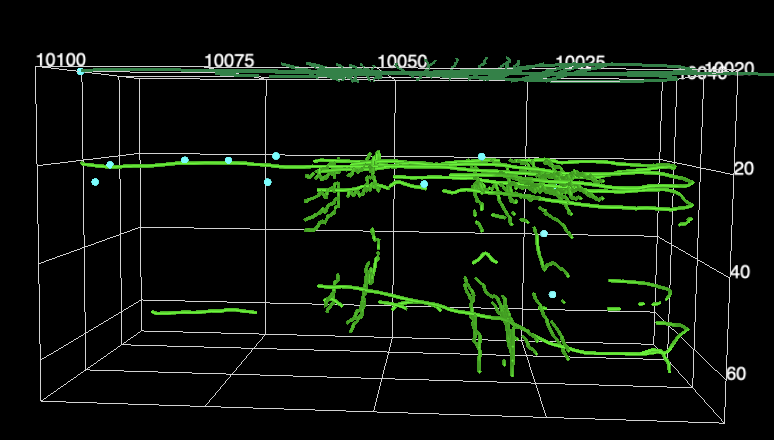

Image 1 shows the layers found in many (not all) of the 2D radargrams. Dark green lines show surface radar tracks, within ~1-2m accuracy. Two very bright layers can be seen consistently in the light green traces, around 230 ns (~3m depth) and 4-450 ns (~6m depth). We hypothesize these are the 2016 and 2014 summer surfaces, given accumulation rates at Camp Recovery (note, [MAR doesn't necessarily agree](/FirnGPRProjWNanna/MAROutput.md){: .internal-link}). Blue dots are (likely) ice lenses, and were largely found in N-S radar lines, not E-W.[1] 

[1] Does this indicate they mostly form in the N-S direction & does this line up with expectations from topo?
