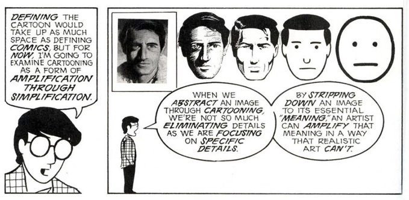

Revision is always difficult… but thinking of it as amplification of an idea makes it easier (e.g. what you keep is important. but how to tell others that you have kept these things after rigorous prunining?)

Science communication could benefit from the framing of simplification as amplification. We simplify the message, we choose what to keep, we amplify what stays, and the message (how many and who hears it)

#writing
#science
#scicomm

