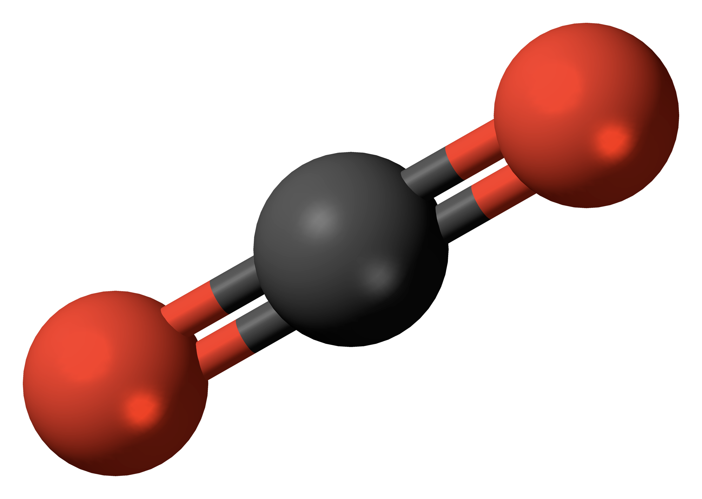

Carbon dioxide ($CO_2$) is colorless, odorless gas made of one carbon atom bonded to two oxygen atoms. 

It plays a vital role in the [carbon cycle](/rda/carbon cycle/cccf-carbon-cycle): plants use carbon dioxide for photosynthesis, producing oxygen as a biproduct. Animals breathe out carbon dioxide; it is also produced by burning organic matter (like fossil fuels and trees). 

$CO_2$ is an important [greenhouse gas](/rda/atmosphere/cccf-greenhouse){: .internal-link}, keeping the planet warm enough for life by capturing infrared radiation emitted from the earth’s surface. Since humans began burning fossil fuels in the mid 19th century, $CO_2$ concentration in the atmosphere has steadily risen.

